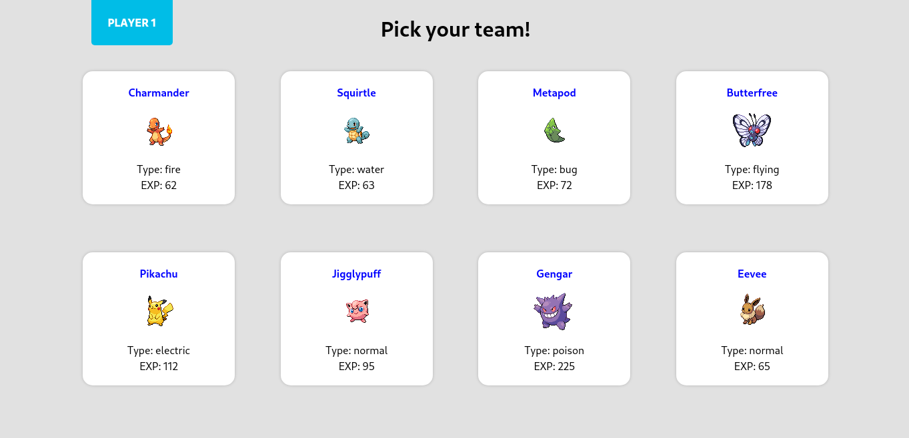

:robot: under development :robot:
---------------------------------

[Poke Battle Game](https://6178897de23c8c00087003ca--sad-shirley-ac6d59.netlify.app/)
======================================================================================

A Pokemon Battle simulator game made in React for studying purposes.

Used technologies
-----------------

*   The application consumes an [API](https://github.com/PokeAPI/pokeapi) to get pokemons images.
*   **React used in the frontend**

Features
--------

### Functional requirements

*   List some pokemons
*   Pick pokemons to battle
*   Show the winner player

### Non functional requirements

*   Simple API consumption
*   Use React for the frontend
  

Screens
-------

### Home

Requirements
------------

*   Node.js
*   Internet connection
*   Internet browser
*   A terminal emulator

How to run
----------

*   Download the project from GitHub
*   Extract project folder if needed
*   Go to the project folder and open a terminal emulator (Gnome Terminal, CMD...)
*   Type 'npm start' and hit enter

### or

[Click-me!](https://6178897de23c8c00087003ca--sad-shirley-ac6d59.netlify.app/)

### Credits

All images rights goes to Nintendo
----------------------------------

Images taken from  [PokeAPI](https://github.com/PokeAPI/pokeapi)
----------------------------
